Daily是一个仿微信朋友圈项目，后端使用GoLang，前端使用HTML5/CSS3 + Javascript

Daily的主要特性有

- 多账户同时登陆，快速切换账户发布动态
- 发布类型支持文本、多图、视频、音乐、外站音视频、内置卡片
- 支持编辑已发布内容
- 支持发布为仅自己查看
- 支持登陆用户以及游客赞和评论
- 游客评论需要管理员批准后方可展示
- 存储支持本地存储、远程服务器存储、S3存储、123云盘

## 效果预览

### 首页

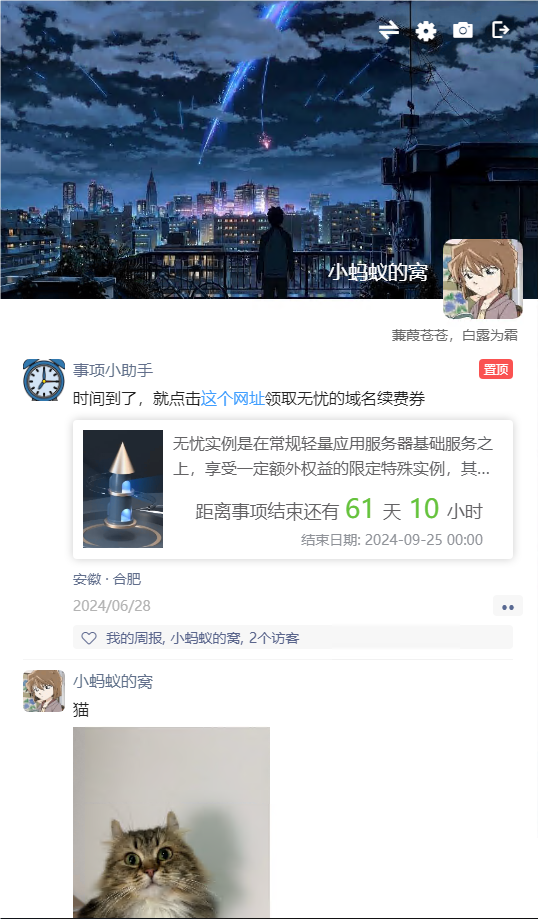

### 发布页面

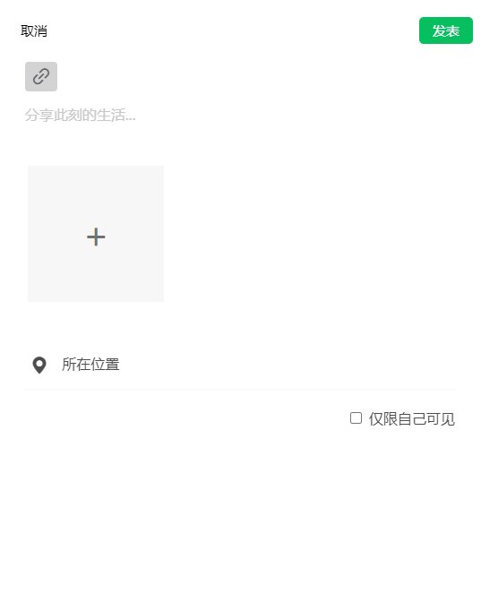

### 设置页面

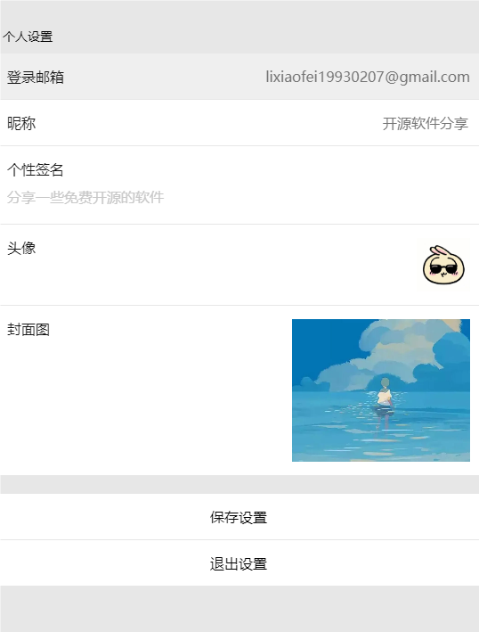

## 开始部署

下面介绍通过Docker部署的方式，其余部署方式可以参考部署

### 部署数据库

Daily使用mysql来存储数据，因此需要先部署一个MYSQL数据库

```bash
docker run -d --name daily_db --restart always -v /data/daily/db:/var/lib/mysql --env MYSQL_RANDOM_ROOT_PASSWORD=yes --env MYSQL_DATABASE=daily --env MYSQL_USER=daily --env MYSQL_PASSWORD=daily123 mysql
```

> 需要将mysql的/var/lib/mysql挂载到宿主机的指定目录，从而来持久化数据

### 部署Daily

然后部署Daily

```bash
docker run -d --name daily --restart always -v /data/daily/upload:/app/data -p 80:8081 --link daily_db mrlee326/daily:latest
```

> /data/daily/upload 为宿主机上的目录，根据需要设置。 如果不准备使用本地存储模式来保存用户上传的数据，则不需要挂载。

### 配置Daily

和大多数项目一样，第一次访问Daily会进入到配置页面，需要正确配置后才能使用。访问下面的网址进行配置。请注意需要将127.0.0.1替换成服务器的IP

http://127.0.0.1:80

打开后看到的页面应该如下

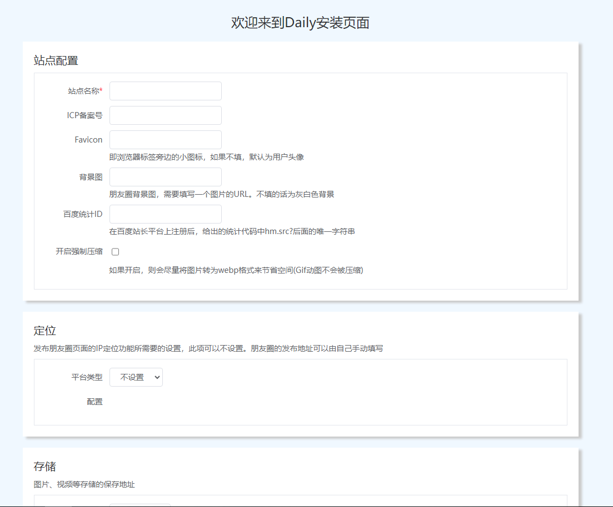

其中有红色 * 号的都是必填项，其余的可以根据需要来填或者不填。配置页面上已经详细解释了每个配置的作用。这里我们使用以下的配置来配置Daily(忽略了部分非必填项)。

```
站点名称: 无名小站
ICP备案号: 京A-123456789
存储类型: 本地模式
存储类型: 
  配置: 
    根路径: /app/data
登陆: 
  密钥: abc123456   # 请注意，这个地方一定不要和我的填写一样，要随机填写，足够复杂
MYSQL数据库: 
  地址: daily_db
  端口: 3306
  用户名: daily
  密码: daily123
  数据库名称: daily
```

填写完毕后，点击最下面的【提交配置】按钮，提交配置。

如果配置填写的没问题的话，就能看到下面的对话框，点击【确认】后刷新页面。

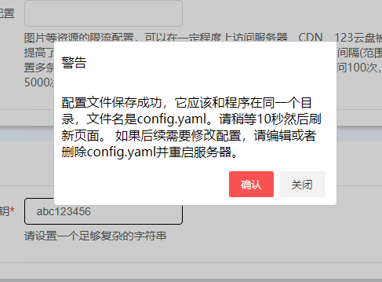

> 后端会校验填写的配置文件，例如所配置的存储是否能够写入数据，所填写的数据库是否能够正常连接。如果校验不通过，会提示错误，要求重新填写。

刷新页面后我们看到的页面如下

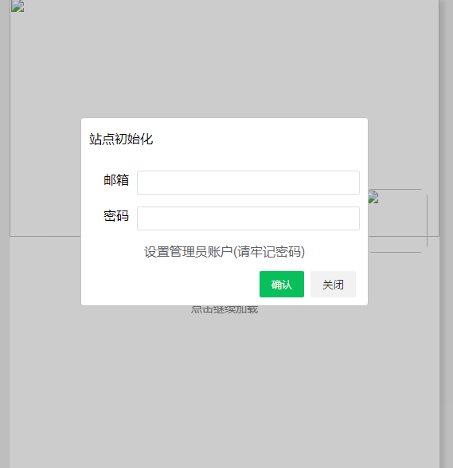

看起来显示的有问题，有些图片并没有加载成功。此时不要慌，设置管理员账号、密码即可。我们这里为了测试，设置为 admin@qq.com / 123456789。

> 请注意那个【请牢记密码】

设置成功后，页面自动跳转到首页。此时应该看到的页面如下


虽然首页看起来不好看，但是不用担心，封面、头像、用户名、个性签名都是可以修改的。如果你不打算修改将存储方式修改为S3存储或者123云盘的话，可以直接跳到【使用文档】一节了


#### 将存储修改为S3

S3存储理论上支持AWS S3、阿里云OSS、腾讯云COS等所有S3兼容存储

> 注意，一般都需要先到您使用的S3存储提供商的后台管理界面设置允许跨域。

如果网站已经配置成功，此时安装页面以及相关接口将自动被关闭无法再次打开。因此需要删除掉配置文件后重新启动Docker容器进行修改

```
docker cp daily:/app/config.yaml ./ # 备份配置文件
docker exec daily  rm -f /app/config.yaml # 删除配置文件
docker restart daily # 重启容器
```

> 当然也可以直接删除掉旧容器，启动新容器

然后重新打开首页，此时又会进入到安装页面。除了其它必填的信息，这次存储选择S3存储。

下面的配置是在腾讯云COS上配置的，理论上兼容阿里云OSS、七牛云、AWS S3以及Cloudflare R2等存储

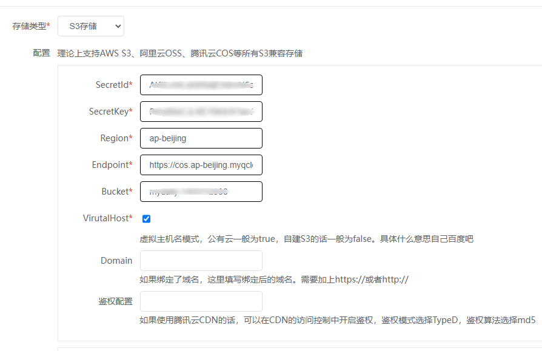

请注意其中的 Endpoint这个输入框，有些对象存储服务商给出的访问域名可能会包含对象存储的bucket名称，例如腾讯云COS给的访问域名如下

```
https://mydaily-xxxxxx.cos.ap-beijing.myqcloud.com
```

此时应该删除url中包含的桶名称，例如删除mydaily-xxxxxx，应该填写的正确地址是

```
https://cos.ap-beijing.myqcloud.com
```

如果绑定了CDN域名的话，可以在【Domain】输入框里填写域名地址(包含https://)。例如

https://cdn.foo.bar

如果使用的腾讯云CDN的话，可以在腾讯云CDN处开启鉴权，鉴权模式选择TypeD，鉴权算法选择md5，然后把对应的key配置到【鉴权配置】输入框中

#### 将存储修改为123云盘

使用123云盘存储需要开通123云盘会员，并且有剩余的直链流量

如果网站已经配置成功，此时安装页面以及相关接口将自动被关闭无法再次打开。因此需要删除掉配置文件后重新启动Docker容器进行修改

```
docker cp daily:/app/config.yaml ./ # 备份配置文件
docker exec daily  rm -f /app/config.yaml # 删除配置文件
docker restart daily # 重启容器
```

然后重新打开首页，此时又会进入到安装页面。除了其它必填的信息，这次存储选择123云盘。

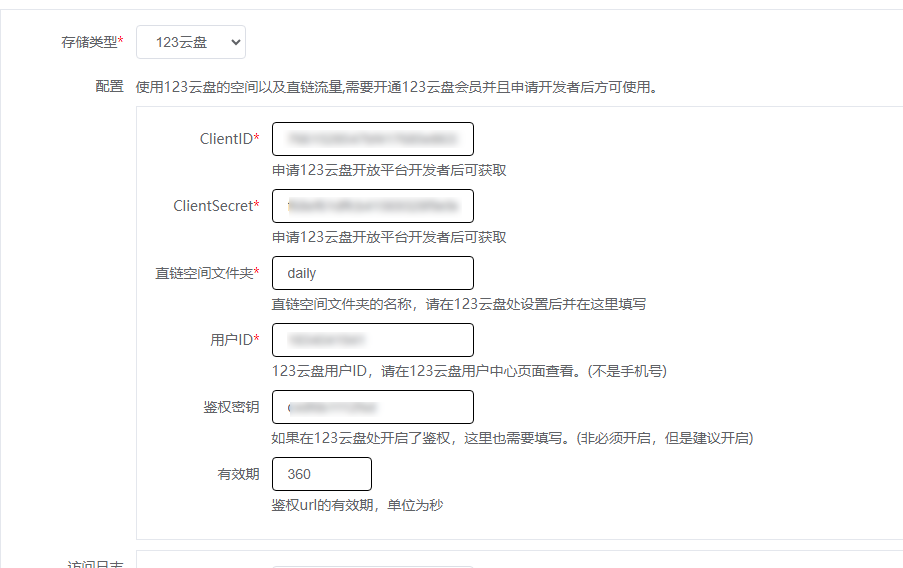


注意事项:
1. 这次保存会很慢，请耐心等待，大概30秒
2. 如果提示有重复文件无法写入，请到直链空间目录下删除文件 【测试文件_可以随时删除.txt】，然后重试


#### 存储迁移

如果在使用过程中需要更换存储方式，将整个storage目录复制到另外一个存储上，并重新配置存储方式即可。

## 使用文档

### 登陆

点击首页右上角的登陆图标，输入管理员账户的邮箱以及密码，点击【确认】进行登录
如果用户名以及密码都正确的话，登陆成功后页面会自动跳转到首页，此时页面顶部会多出一排图标，如下


### 修改个人信息

此时我们应该做的是修改封面、头像、用户名、个性签名，以此来替换掉默认的信息，点击页面上方的设置按钮，会弹出设置页面，如下图所示

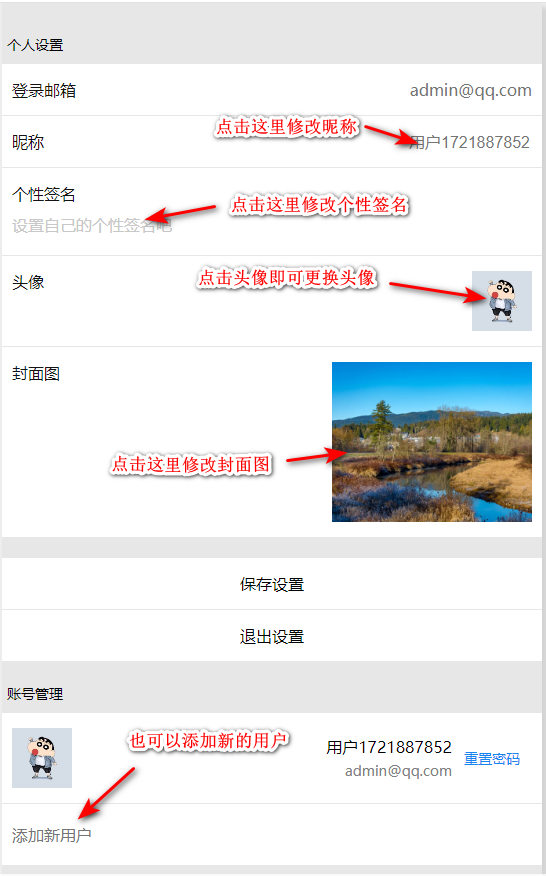

修改成自己喜欢的信息，点击【保存】，保存成功后刷新页面即可看到修改后的效果


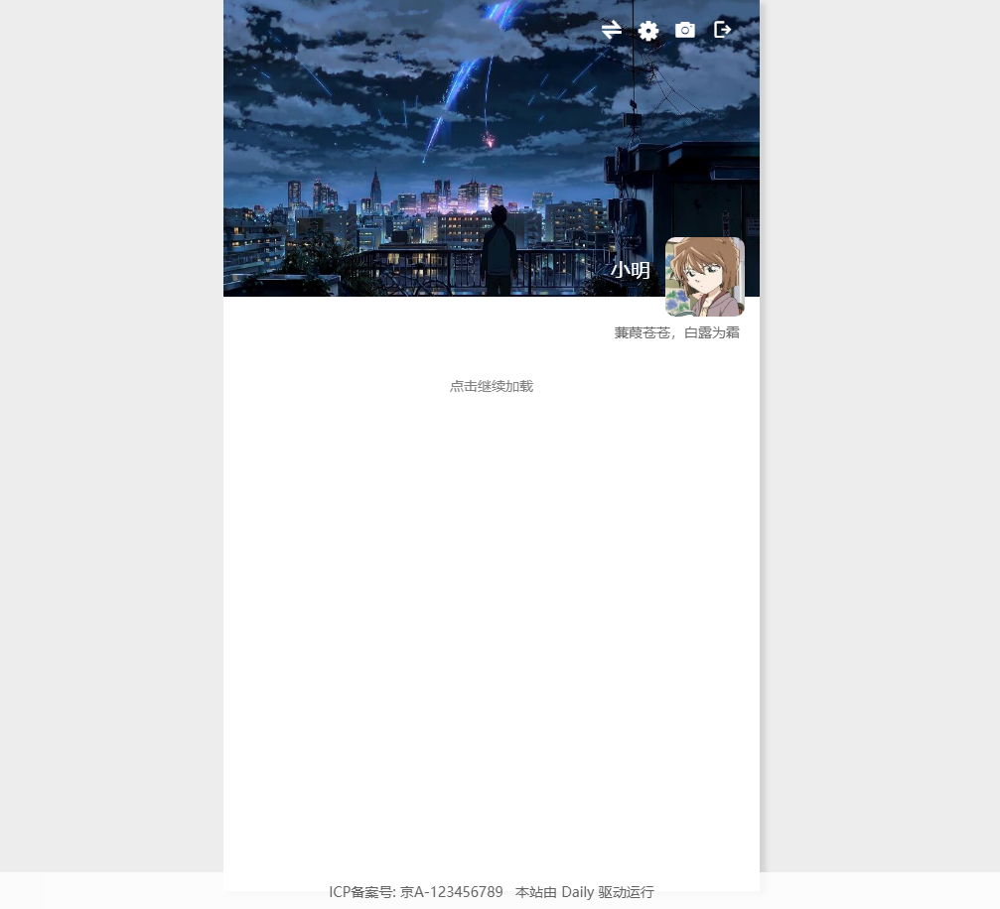

### 添加新用户

管理员用户在设置页面也可以添加新用户，添加的新用户也需要登陆以后在设置页面修改封面、头像、用户名、个性签名等信息。

### 切换账户

支持添加多用户以及快捷切换用户，可以用每个账户只做一类事情，例如用【主账号】账户分享日常生活，用【事项助手】账户来创建代办事项，用【音乐分享】账户来分享音乐。
然后可以在首页点击动态的用户名或者头像进入到该用户的主页，用户主页只显示此用户发布的动态。

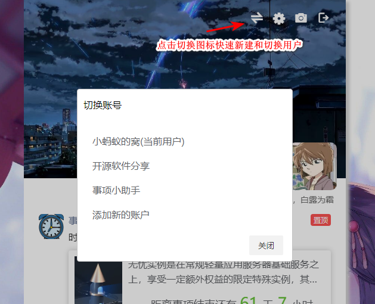


### 发布动态

点击顶部的照相机图标，会弹出对话框来询问发布类型

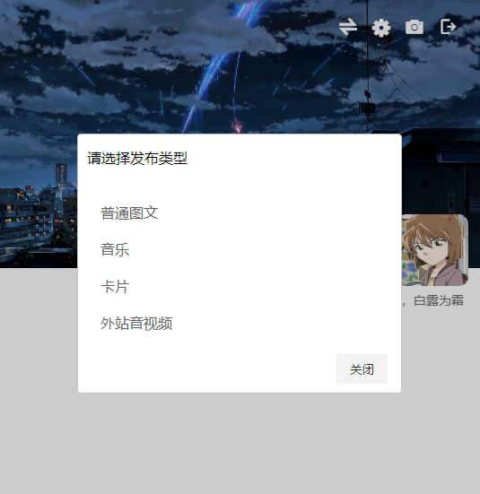

如图所示目前主要支持四种类型的动态
- 普通图文
- 音乐
- 卡片
- 外站音视频

**普通图文** 就是最常见的朋友圈动态的类型，可以是一段文字、若干个图片或者是一个视频

下面是普通图文的发布页面

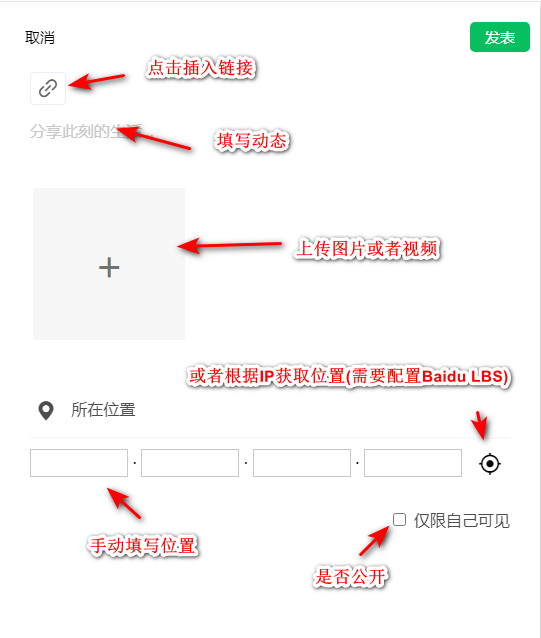

让我们假装在威尼斯旅行吧(图片来源于网络)

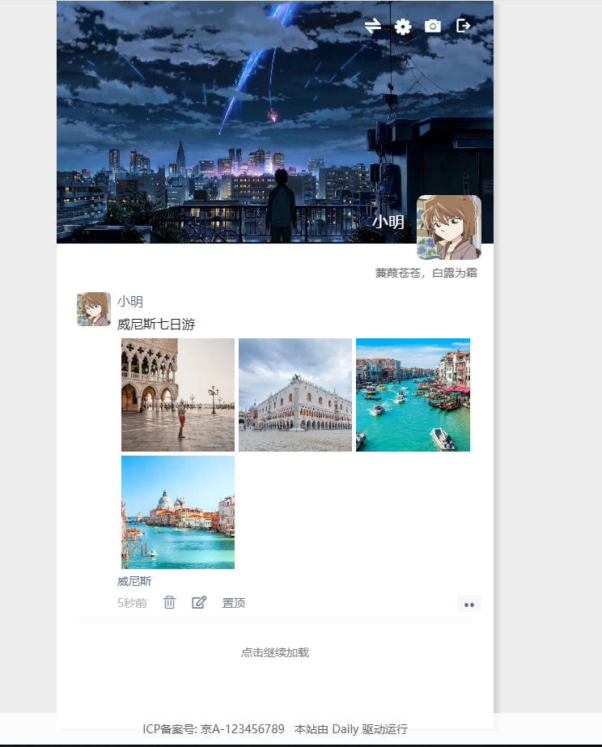

若上图所示，可以编辑和删除这个图文消息。

> 编辑功能仅限于在普通图文动态上使用，且编辑过的动态会在右下角显示【已编辑】

**音乐** 发布一首好听的音乐

如果想和别人分享喜欢的音乐，可以分享音乐动态

> 这里的音乐需要自己上传mp3文件，如果想直接分享网易云音乐或者QQ音乐上的音乐，则应该选择【外站音视频】

下面是音乐的发布页面

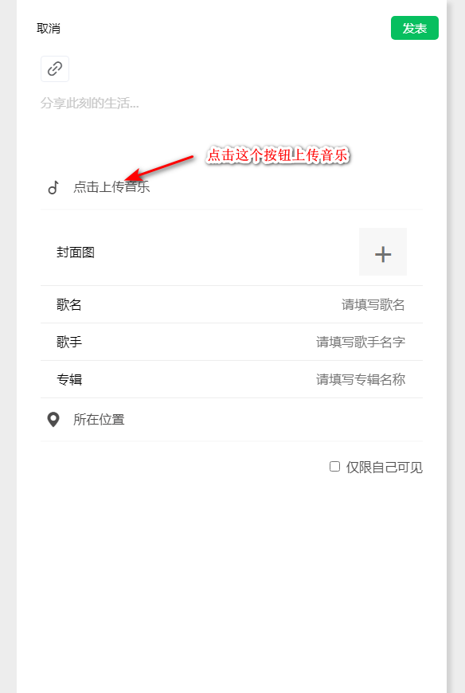

上传mp3音乐，会自动解析mp3文件中的封面、歌手、专辑等信息，如果不包含这些信息的话，需要手动设置。

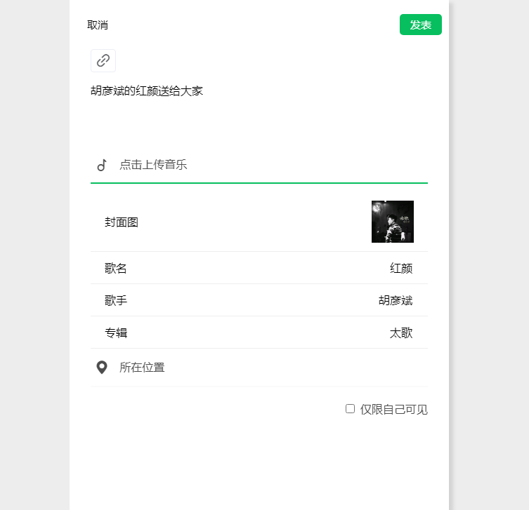

上传完毕后点击【发表】按钮即可。发布效果如下

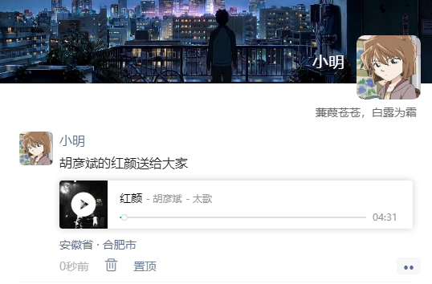


**卡片**

目前支持的卡片类型有 个人名片、文章分享、通用卡片以及待办事项，根据页面显示的输入框输入即可。

进阶: 如果需要自定义卡片，不需要修改源代码，只需要在 public/card下创建对应的卡片模板即可。

> 目前自定义卡片的css不能使用太复杂的语法，例如不能使用 , > 等符号


**外站音视频**

目前支持的外站音视频有B站、腾讯视频、优酷视频、YouTuBe、QQ音乐、网易云音乐。
如下图所示，只需要输入对应的资源的ID即可。

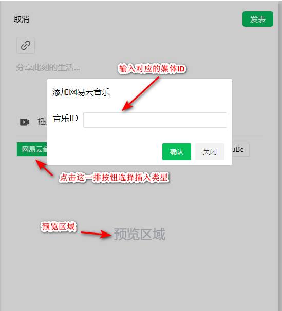

下面来说一下具体每个资源的ID是怎么获取

#### B站

打开喜欢的UP主的视频，在浏览器地址栏能看到类似于下面的URL，其中的BV1oy411i7mn就是这个视频的ID
```
https://www.bilibili.com/video/BV1oy411i7mn/?t=7&spm_id_from=333.1007.tianma.9-3-33.click
```

将BV1oy411i7mn填入输入框

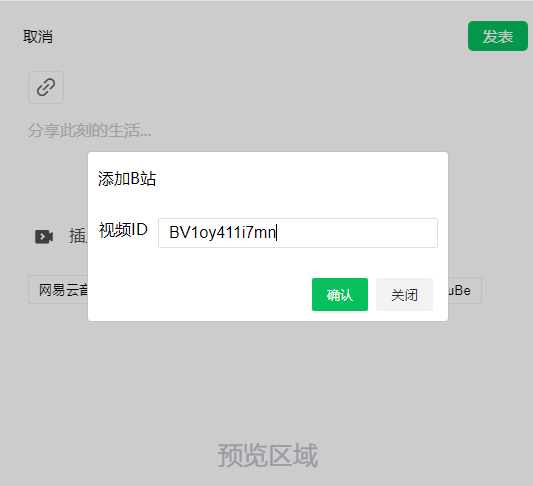

点击确认后，下方会显示预览效果

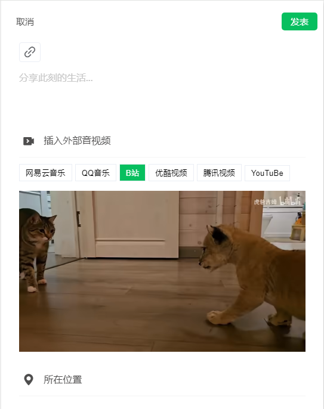

发布后的效果如图所示

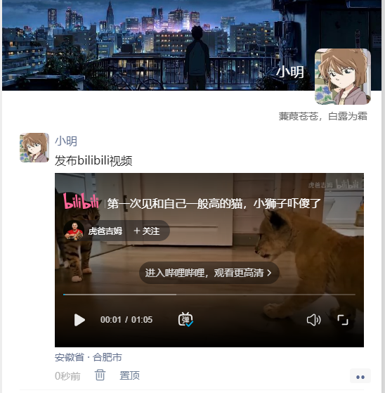

#### 腾讯视频

打开喜欢的视频，在浏览器地址栏能看到类似于下面的URL，其中的t4100m48tm4就是这个视频的ID

```
https://v.qq.com/x/cover/mzc00200kusah9g/t4100m48tm4.html
```

预览效果如下


#### 优酷视频

此功能暂时不可用

#### YouTuBe

打开喜欢的UP主的视频，在浏览器地址栏能看到类似于下面的URL，其中的v=ISKvhNO3NHo中的ISKvhNO3NHo就是这个视频的ID

```
https://www.youtube.com/watch?v=ISKvhNO3NHo&ab_channel=%E5%BD%B1%E8%A7%86%E5%A4%A7%E4%B8%96%E7%95%8C
```

预览效果如下


#### 网易云音乐

打开喜欢的音乐，在浏览器地址栏能看到类似于下面的URL，其中的307198就是这个音乐的ID

```
https://music.163.com/#/song?id=307198
```

预览效果如下


#### QQ音乐

打开喜欢的音乐，在音乐播放界面进行如下操作

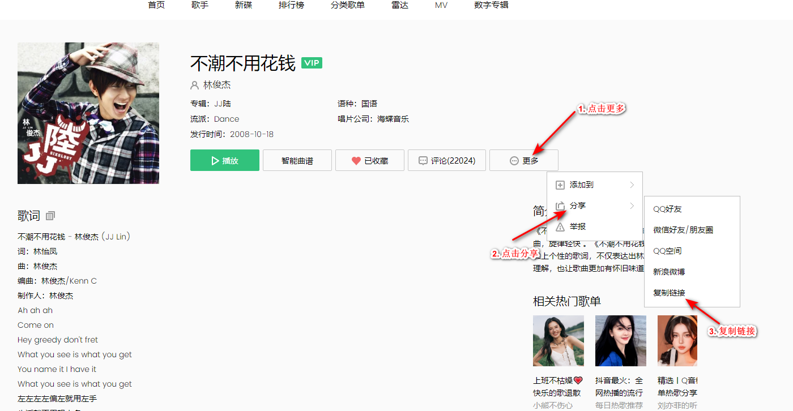

复制的链接应该是类似于下面的URL，其中447252就是这个音乐的ID
```
https://i.y.qq.com/v8/playsong.html?songid=447252&songtype=0#webchat_redirect
```

预览效果如下

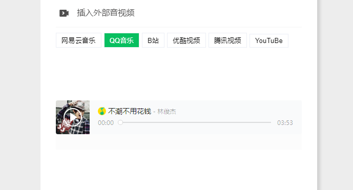

### 评论

根据页面操作即可

游客的评论默认不会公开显示，需要管理员或者发布动态的用户登陆后批准评论后才会公开显示

### 点赞

根据页面操作即可。游客点赞是根据IP判断的。

评论和赞的界面如下

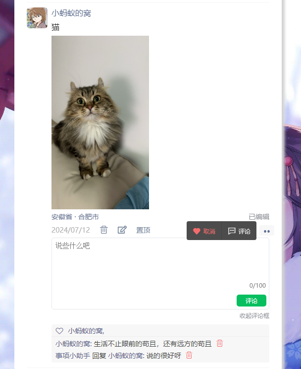

